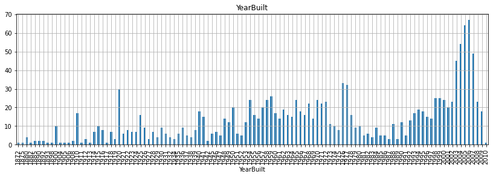
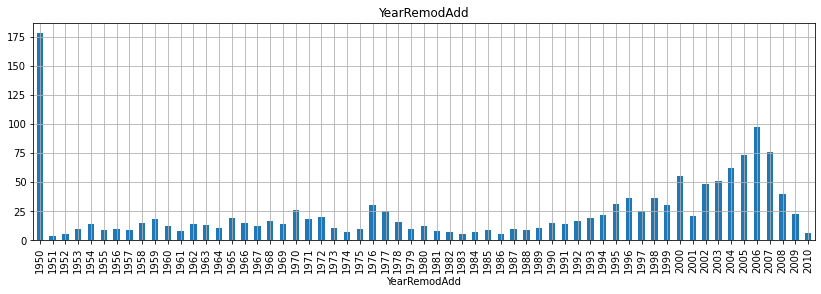
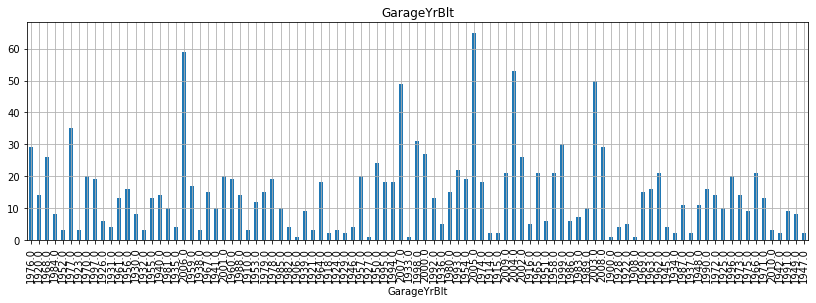
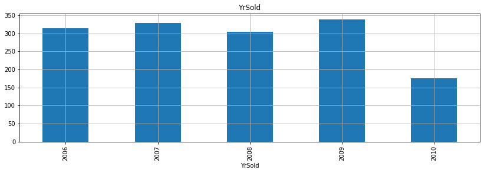
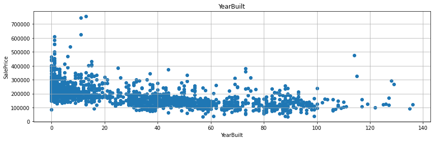
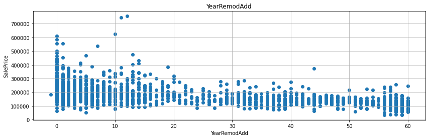
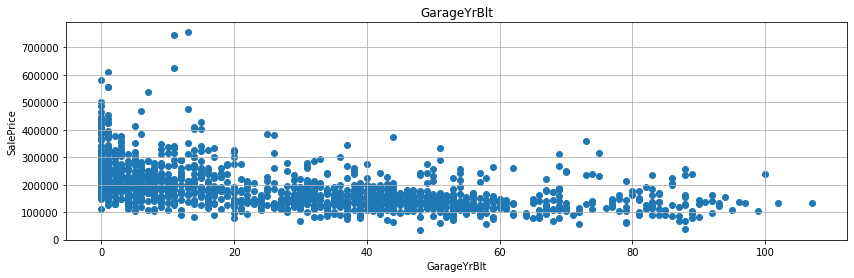
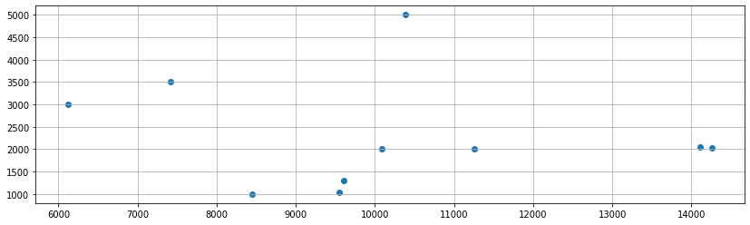
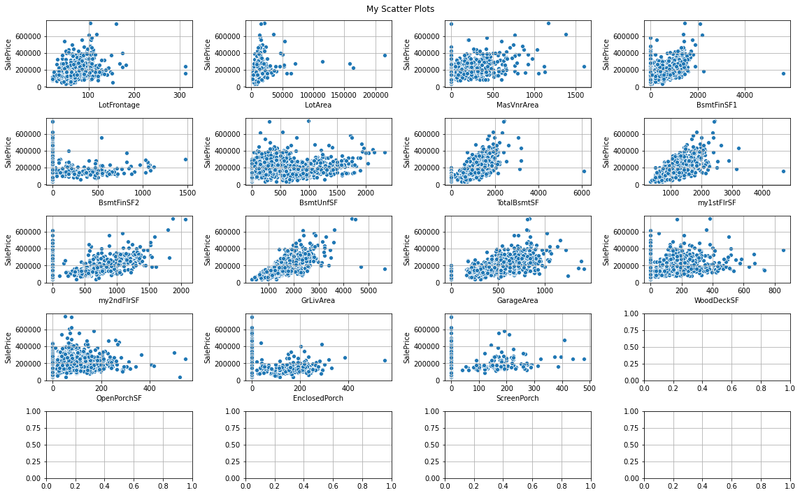

```python
from google.colab import drive
from os.path import join

ROOT = "/content/drive" 
drive.mount(ROOT)  
print(ROOT)
```

    Drive already mounted at /content/drive; to attempt to forcibly remount, call drive.mount("/content/drive", force_remount=True).
    /content/drive
    


```python
%cd "/content/drive/My Drive/Colab Notebooks/ml_project/house_price_train"
```

    /content/drive/My Drive/Colab Notebooks/ml_project/house_price_train
    


```python
%ls
```

    sample_submission.csv  test.csv  train.csv
    


```python
import pandas as pd
import pandas_profiling
import numpy as np
import matplotlib as mpl
import matplotlib.pyplot as plt
from matplotlib.pyplot import figure
import seaborn as sns

from IPython.core.display import display, HTML
from pandas_profiling import ProfileReport
```

    /usr/local/lib/python3.6/dist-packages/statsmodels/tools/_testing.py:19: FutureWarning: pandas.util.testing is deprecated. Use the functions in the public API at pandas.testing instead.
      import pandas.util.testing as tm
    


```python
%matplotlib inline
import matplotlib.pylab as plt

plt.rcParams["figure.figsize"] = (14,4)
plt.rcParams['lines.linewidth'] = 2
plt.rcParams['lines.color'] = 'r'
plt.rcParams['axes.grid'] = True 
```


```python
# 이건 구글드라이브에서 읽어온.
test = pd.read_csv('test.csv')
test
```


<div>
<style scoped>
    .dataframe tbody tr th:only-of-type {
        vertical-align: middle;
    }

    .dataframe tbody tr th {
        vertical-align: top;
    }

    .dataframe thead th {
        text-align: right;
    }
</style>
<table border="1" class="dataframe">
  <thead>
    <tr style="text-align: right;">
      <th></th>
      <th>Id</th>
      <th>MSSubClass</th>
      <th>MSZoning</th>
      <th>LotFrontage</th>
      <th>LotArea</th>
      <th>Street</th>
      <th>Alley</th>
      <th>LotShape</th>
      <th>LandContour</th>
      <th>Utilities</th>
      <th>LotConfig</th>
      <th>LandSlope</th>
      <th>Neighborhood</th>
      <th>Condition1</th>
      <th>Condition2</th>
      <th>BldgType</th>
      <th>HouseStyle</th>
      <th>OverallQual</th>
      <th>OverallCond</th>
      <th>YearBuilt</th>
      <th>YearRemodAdd</th>
      <th>RoofStyle</th>
      <th>RoofMatl</th>
      <th>Exterior1st</th>
      <th>Exterior2nd</th>
      <th>MasVnrType</th>
      <th>MasVnrArea</th>
      <th>ExterQual</th>
      <th>ExterCond</th>
      <th>Foundation</th>
      <th>BsmtQual</th>
      <th>BsmtCond</th>
      <th>BsmtExposure</th>
      <th>BsmtFinType1</th>
      <th>BsmtFinSF1</th>
      <th>BsmtFinType2</th>
      <th>BsmtFinSF2</th>
      <th>BsmtUnfSF</th>
      <th>TotalBsmtSF</th>
      <th>Heating</th>
      <th>HeatingQC</th>
      <th>CentralAir</th>
      <th>Electrical</th>
      <th>1stFlrSF</th>
      <th>2ndFlrSF</th>
      <th>LowQualFinSF</th>
      <th>GrLivArea</th>
      <th>BsmtFullBath</th>
      <th>BsmtHalfBath</th>
      <th>FullBath</th>
      <th>HalfBath</th>
      <th>BedroomAbvGr</th>
      <th>KitchenAbvGr</th>
      <th>KitchenQual</th>
      <th>TotRmsAbvGrd</th>
      <th>Functional</th>
      <th>Fireplaces</th>
      <th>FireplaceQu</th>
      <th>GarageType</th>
      <th>GarageYrBlt</th>
      <th>GarageFinish</th>
      <th>GarageCars</th>
      <th>GarageArea</th>
      <th>GarageQual</th>
      <th>GarageCond</th>
      <th>PavedDrive</th>
      <th>WoodDeckSF</th>
      <th>OpenPorchSF</th>
      <th>EnclosedPorch</th>
      <th>3SsnPorch</th>
      <th>ScreenPorch</th>
      <th>PoolArea</th>
      <th>PoolQC</th>
      <th>Fence</th>
      <th>MiscFeature</th>
      <th>MiscVal</th>
      <th>MoSold</th>
      <th>YrSold</th>
      <th>SaleType</th>
      <th>SaleCondition</th>
    </tr>
  </thead>
  <tbody>
    <tr>
      <th>0</th>
      <td>1461</td>
      <td>20</td>
      <td>RH</td>
      <td>80.0</td>
      <td>11622</td>
      <td>Pave</td>
      <td>NaN</td>
      <td>Reg</td>
      <td>Lvl</td>
      <td>AllPub</td>
      <td>Inside</td>
      <td>Gtl</td>
      <td>NAmes</td>
      <td>Feedr</td>
      <td>Norm</td>
      <td>1Fam</td>
      <td>1Story</td>
      <td>5</td>
      <td>6</td>
      <td>1961</td>
      <td>1961</td>
      <td>Gable</td>
      <td>CompShg</td>
      <td>VinylSd</td>
      <td>VinylSd</td>
      <td>None</td>
      <td>0.0</td>
      <td>TA</td>
      <td>TA</td>
      <td>CBlock</td>
      <td>TA</td>
      <td>TA</td>
      <td>No</td>
      <td>Rec</td>
      <td>468.0</td>
      <td>LwQ</td>
      <td>144.0</td>
      <td>270.0</td>
      <td>882.0</td>
      <td>GasA</td>
      <td>TA</td>
      <td>Y</td>
      <td>SBrkr</td>
      <td>896</td>
      <td>0</td>
      <td>0</td>
      <td>896</td>
      <td>0.0</td>
      <td>0.0</td>
      <td>1</td>
      <td>0</td>
      <td>2</td>
      <td>1</td>
      <td>TA</td>
      <td>5</td>
      <td>Typ</td>
      <td>0</td>
      <td>NaN</td>
      <td>Attchd</td>
      <td>1961.0</td>
      <td>Unf</td>
      <td>1.0</td>
      <td>730.0</td>
      <td>TA</td>
      <td>TA</td>
      <td>Y</td>
      <td>140</td>
      <td>0</td>
      <td>0</td>
      <td>0</td>
      <td>120</td>
      <td>0</td>
      <td>NaN</td>
      <td>MnPrv</td>
      <td>NaN</td>
      <td>0</td>
      <td>6</td>
      <td>2010</td>
      <td>WD</td>
      <td>Normal</td>
    </tr>
    <tr>
      <th>1</th>
      <td>1462</td>
      <td>20</td>
      <td>RL</td>
      <td>81.0</td>
      <td>14267</td>
      <td>Pave</td>
      <td>NaN</td>
      <td>IR1</td>
      <td>Lvl</td>
      <td>AllPub</td>
      <td>Corner</td>
      <td>Gtl</td>
      <td>NAmes</td>
      <td>Norm</td>
      <td>Norm</td>
      <td>1Fam</td>
      <td>1Story</td>
      <td>6</td>
      <td>6</td>
      <td>1958</td>
      <td>1958</td>
      <td>Hip</td>
      <td>CompShg</td>
      <td>Wd Sdng</td>
      <td>Wd Sdng</td>
      <td>BrkFace</td>
      <td>108.0</td>
      <td>TA</td>
      <td>TA</td>
      <td>CBlock</td>
      <td>TA</td>
      <td>TA</td>
      <td>No</td>
      <td>ALQ</td>
      <td>923.0</td>
      <td>Unf</td>
      <td>0.0</td>
      <td>406.0</td>
      <td>1329.0</td>
      <td>GasA</td>
      <td>TA</td>
      <td>Y</td>
      <td>SBrkr</td>
      <td>1329</td>
      <td>0</td>
      <td>0</td>
      <td>1329</td>
      <td>0.0</td>
      <td>0.0</td>
      <td>1</td>
      <td>1</td>
      <td>3</td>
      <td>1</td>
      <td>Gd</td>
      <td>6</td>
      <td>Typ</td>
      <td>0</td>
      <td>NaN</td>
      <td>Attchd</td>
      <td>1958.0</td>
      <td>Unf</td>
      <td>1.0</td>
      <td>312.0</td>
      <td>TA</td>
      <td>TA</td>
      <td>Y</td>
      <td>393</td>
      <td>36</td>
      <td>0</td>
      <td>0</td>
      <td>0</td>
      <td>0</td>
      <td>NaN</td>
      <td>NaN</td>
      <td>Gar2</td>
      <td>12500</td>
      <td>6</td>
      <td>2010</td>
      <td>WD</td>
      <td>Normal</td>
    </tr>
    <tr>
      <th>2</th>
      <td>1463</td>
      <td>60</td>
      <td>RL</td>
      <td>74.0</td>
      <td>13830</td>
      <td>Pave</td>
      <td>NaN</td>
      <td>IR1</td>
      <td>Lvl</td>
      <td>AllPub</td>
      <td>Inside</td>
      <td>Gtl</td>
      <td>Gilbert</td>
      <td>Norm</td>
      <td>Norm</td>
      <td>1Fam</td>
      <td>2Story</td>
      <td>5</td>
      <td>5</td>
      <td>1997</td>
      <td>1998</td>
      <td>Gable</td>
      <td>CompShg</td>
      <td>VinylSd</td>
      <td>VinylSd</td>
      <td>None</td>
      <td>0.0</td>
      <td>TA</td>
      <td>TA</td>
      <td>PConc</td>
      <td>Gd</td>
      <td>TA</td>
      <td>No</td>
      <td>GLQ</td>
      <td>791.0</td>
      <td>Unf</td>
      <td>0.0</td>
      <td>137.0</td>
      <td>928.0</td>
      <td>GasA</td>
      <td>Gd</td>
      <td>Y</td>
      <td>SBrkr</td>
      <td>928</td>
      <td>701</td>
      <td>0</td>
      <td>1629</td>
      <td>0.0</td>
      <td>0.0</td>
      <td>2</td>
      <td>1</td>
      <td>3</td>
      <td>1</td>
      <td>TA</td>
      <td>6</td>
      <td>Typ</td>
      <td>1</td>
      <td>TA</td>
      <td>Attchd</td>
      <td>1997.0</td>
      <td>Fin</td>
      <td>2.0</td>
      <td>482.0</td>
      <td>TA</td>
      <td>TA</td>
      <td>Y</td>
      <td>212</td>
      <td>34</td>
      <td>0</td>
      <td>0</td>
      <td>0</td>
      <td>0</td>
      <td>NaN</td>
      <td>MnPrv</td>
      <td>NaN</td>
      <td>0</td>
      <td>3</td>
      <td>2010</td>
      <td>WD</td>
      <td>Normal</td>
    </tr>
    <tr>
      <th>3</th>
      <td>1464</td>
      <td>60</td>
      <td>RL</td>
      <td>78.0</td>
      <td>9978</td>
      <td>Pave</td>
      <td>NaN</td>
      <td>IR1</td>
      <td>Lvl</td>
      <td>AllPub</td>
      <td>Inside</td>
      <td>Gtl</td>
      <td>Gilbert</td>
      <td>Norm</td>
      <td>Norm</td>
      <td>1Fam</td>
      <td>2Story</td>
      <td>6</td>
      <td>6</td>
      <td>1998</td>
      <td>1998</td>
      <td>Gable</td>
      <td>CompShg</td>
      <td>VinylSd</td>
      <td>VinylSd</td>
      <td>BrkFace</td>
      <td>20.0</td>
      <td>TA</td>
      <td>TA</td>
      <td>PConc</td>
      <td>TA</td>
      <td>TA</td>
      <td>No</td>
      <td>GLQ</td>
      <td>602.0</td>
      <td>Unf</td>
      <td>0.0</td>
      <td>324.0</td>
      <td>926.0</td>
      <td>GasA</td>
      <td>Ex</td>
      <td>Y</td>
      <td>SBrkr</td>
      <td>926</td>
      <td>678</td>
      <td>0</td>
      <td>1604</td>
      <td>0.0</td>
      <td>0.0</td>
      <td>2</td>
      <td>1</td>
      <td>3</td>
      <td>1</td>
      <td>Gd</td>
      <td>7</td>
      <td>Typ</td>
      <td>1</td>
      <td>Gd</td>
      <td>Attchd</td>
      <td>1998.0</td>
      <td>Fin</td>
      <td>2.0</td>
      <td>470.0</td>
      <td>TA</td>
      <td>TA</td>
      <td>Y</td>
      <td>360</td>
      <td>36</td>
      <td>0</td>
      <td>0</td>
      <td>0</td>
      <td>0</td>
      <td>NaN</td>
      <td>NaN</td>
      <td>NaN</td>
      <td>0</td>
      <td>6</td>
      <td>2010</td>
      <td>WD</td>
      <td>Normal</td>
    </tr>
    <tr>
      <th>4</th>
      <td>1465</td>
      <td>120</td>
      <td>RL</td>
      <td>43.0</td>
      <td>5005</td>
      <td>Pave</td>
      <td>NaN</td>
      <td>IR1</td>
      <td>HLS</td>
      <td>AllPub</td>
      <td>Inside</td>
      <td>Gtl</td>
      <td>StoneBr</td>
      <td>Norm</td>
      <td>Norm</td>
      <td>TwnhsE</td>
      <td>1Story</td>
      <td>8</td>
      <td>5</td>
      <td>1992</td>
      <td>1992</td>
      <td>Gable</td>
      <td>CompShg</td>
      <td>HdBoard</td>
      <td>HdBoard</td>
      <td>None</td>
      <td>0.0</td>
      <td>Gd</td>
      <td>TA</td>
      <td>PConc</td>
      <td>Gd</td>
      <td>TA</td>
      <td>No</td>
      <td>ALQ</td>
      <td>263.0</td>
      <td>Unf</td>
      <td>0.0</td>
      <td>1017.0</td>
      <td>1280.0</td>
      <td>GasA</td>
      <td>Ex</td>
      <td>Y</td>
      <td>SBrkr</td>
      <td>1280</td>
      <td>0</td>
      <td>0</td>
      <td>1280</td>
      <td>0.0</td>
      <td>0.0</td>
      <td>2</td>
      <td>0</td>
      <td>2</td>
      <td>1</td>
      <td>Gd</td>
      <td>5</td>
      <td>Typ</td>
      <td>0</td>
      <td>NaN</td>
      <td>Attchd</td>
      <td>1992.0</td>
      <td>RFn</td>
      <td>2.0</td>
      <td>506.0</td>
      <td>TA</td>
      <td>TA</td>
      <td>Y</td>
      <td>0</td>
      <td>82</td>
      <td>0</td>
      <td>0</td>
      <td>144</td>
      <td>0</td>
      <td>NaN</td>
      <td>NaN</td>
      <td>NaN</td>
      <td>0</td>
      <td>1</td>
      <td>2010</td>
      <td>WD</td>
      <td>Normal</td>
    </tr>
    <tr>
      <th>...</th>
      <td>...</td>
      <td>...</td>
      <td>...</td>
      <td>...</td>
      <td>...</td>
      <td>...</td>
      <td>...</td>
      <td>...</td>
      <td>...</td>
      <td>...</td>
      <td>...</td>
      <td>...</td>
      <td>...</td>
      <td>...</td>
      <td>...</td>
      <td>...</td>
      <td>...</td>
      <td>...</td>
      <td>...</td>
      <td>...</td>
      <td>...</td>
      <td>...</td>
      <td>...</td>
      <td>...</td>
      <td>...</td>
      <td>...</td>
      <td>...</td>
      <td>...</td>
      <td>...</td>
      <td>...</td>
      <td>...</td>
      <td>...</td>
      <td>...</td>
      <td>...</td>
      <td>...</td>
      <td>...</td>
      <td>...</td>
      <td>...</td>
      <td>...</td>
      <td>...</td>
      <td>...</td>
      <td>...</td>
      <td>...</td>
      <td>...</td>
      <td>...</td>
      <td>...</td>
      <td>...</td>
      <td>...</td>
      <td>...</td>
      <td>...</td>
      <td>...</td>
      <td>...</td>
      <td>...</td>
      <td>...</td>
      <td>...</td>
      <td>...</td>
      <td>...</td>
      <td>...</td>
      <td>...</td>
      <td>...</td>
      <td>...</td>
      <td>...</td>
      <td>...</td>
      <td>...</td>
      <td>...</td>
      <td>...</td>
      <td>...</td>
      <td>...</td>
      <td>...</td>
      <td>...</td>
      <td>...</td>
      <td>...</td>
      <td>...</td>
      <td>...</td>
      <td>...</td>
      <td>...</td>
      <td>...</td>
      <td>...</td>
      <td>...</td>
      <td>...</td>
    </tr>
    <tr>
      <th>1454</th>
      <td>2915</td>
      <td>160</td>
      <td>RM</td>
      <td>21.0</td>
      <td>1936</td>
      <td>Pave</td>
      <td>NaN</td>
      <td>Reg</td>
      <td>Lvl</td>
      <td>AllPub</td>
      <td>Inside</td>
      <td>Gtl</td>
      <td>MeadowV</td>
      <td>Norm</td>
      <td>Norm</td>
      <td>Twnhs</td>
      <td>2Story</td>
      <td>4</td>
      <td>7</td>
      <td>1970</td>
      <td>1970</td>
      <td>Gable</td>
      <td>CompShg</td>
      <td>CemntBd</td>
      <td>CmentBd</td>
      <td>None</td>
      <td>0.0</td>
      <td>TA</td>
      <td>TA</td>
      <td>CBlock</td>
      <td>TA</td>
      <td>TA</td>
      <td>No</td>
      <td>Unf</td>
      <td>0.0</td>
      <td>Unf</td>
      <td>0.0</td>
      <td>546.0</td>
      <td>546.0</td>
      <td>GasA</td>
      <td>Gd</td>
      <td>Y</td>
      <td>SBrkr</td>
      <td>546</td>
      <td>546</td>
      <td>0</td>
      <td>1092</td>
      <td>0.0</td>
      <td>0.0</td>
      <td>1</td>
      <td>1</td>
      <td>3</td>
      <td>1</td>
      <td>TA</td>
      <td>5</td>
      <td>Typ</td>
      <td>0</td>
      <td>NaN</td>
      <td>NaN</td>
      <td>NaN</td>
      <td>NaN</td>
      <td>0.0</td>
      <td>0.0</td>
      <td>NaN</td>
      <td>NaN</td>
      <td>Y</td>
      <td>0</td>
      <td>0</td>
      <td>0</td>
      <td>0</td>
      <td>0</td>
      <td>0</td>
      <td>NaN</td>
      <td>NaN</td>
      <td>NaN</td>
      <td>0</td>
      <td>6</td>
      <td>2006</td>
      <td>WD</td>
      <td>Normal</td>
    </tr>
    <tr>
      <th>1455</th>
      <td>2916</td>
      <td>160</td>
      <td>RM</td>
      <td>21.0</td>
      <td>1894</td>
      <td>Pave</td>
      <td>NaN</td>
      <td>Reg</td>
      <td>Lvl</td>
      <td>AllPub</td>
      <td>Inside</td>
      <td>Gtl</td>
      <td>MeadowV</td>
      <td>Norm</td>
      <td>Norm</td>
      <td>TwnhsE</td>
      <td>2Story</td>
      <td>4</td>
      <td>5</td>
      <td>1970</td>
      <td>1970</td>
      <td>Gable</td>
      <td>CompShg</td>
      <td>CemntBd</td>
      <td>CmentBd</td>
      <td>None</td>
      <td>0.0</td>
      <td>TA</td>
      <td>TA</td>
      <td>CBlock</td>
      <td>TA</td>
      <td>TA</td>
      <td>No</td>
      <td>Rec</td>
      <td>252.0</td>
      <td>Unf</td>
      <td>0.0</td>
      <td>294.0</td>
      <td>546.0</td>
      <td>GasA</td>
      <td>TA</td>
      <td>Y</td>
      <td>SBrkr</td>
      <td>546</td>
      <td>546</td>
      <td>0</td>
      <td>1092</td>
      <td>0.0</td>
      <td>0.0</td>
      <td>1</td>
      <td>1</td>
      <td>3</td>
      <td>1</td>
      <td>TA</td>
      <td>6</td>
      <td>Typ</td>
      <td>0</td>
      <td>NaN</td>
      <td>CarPort</td>
      <td>1970.0</td>
      <td>Unf</td>
      <td>1.0</td>
      <td>286.0</td>
      <td>TA</td>
      <td>TA</td>
      <td>Y</td>
      <td>0</td>
      <td>24</td>
      <td>0</td>
      <td>0</td>
      <td>0</td>
      <td>0</td>
      <td>NaN</td>
      <td>NaN</td>
      <td>NaN</td>
      <td>0</td>
      <td>4</td>
      <td>2006</td>
      <td>WD</td>
      <td>Abnorml</td>
    </tr>
    <tr>
      <th>1456</th>
      <td>2917</td>
      <td>20</td>
      <td>RL</td>
      <td>160.0</td>
      <td>20000</td>
      <td>Pave</td>
      <td>NaN</td>
      <td>Reg</td>
      <td>Lvl</td>
      <td>AllPub</td>
      <td>Inside</td>
      <td>Gtl</td>
      <td>Mitchel</td>
      <td>Norm</td>
      <td>Norm</td>
      <td>1Fam</td>
      <td>1Story</td>
      <td>5</td>
      <td>7</td>
      <td>1960</td>
      <td>1996</td>
      <td>Gable</td>
      <td>CompShg</td>
      <td>VinylSd</td>
      <td>VinylSd</td>
      <td>None</td>
      <td>0.0</td>
      <td>TA</td>
      <td>TA</td>
      <td>CBlock</td>
      <td>TA</td>
      <td>TA</td>
      <td>No</td>
      <td>ALQ</td>
      <td>1224.0</td>
      <td>Unf</td>
      <td>0.0</td>
      <td>0.0</td>
      <td>1224.0</td>
      <td>GasA</td>
      <td>Ex</td>
      <td>Y</td>
      <td>SBrkr</td>
      <td>1224</td>
      <td>0</td>
      <td>0</td>
      <td>1224</td>
      <td>1.0</td>
      <td>0.0</td>
      <td>1</td>
      <td>0</td>
      <td>4</td>
      <td>1</td>
      <td>TA</td>
      <td>7</td>
      <td>Typ</td>
      <td>1</td>
      <td>TA</td>
      <td>Detchd</td>
      <td>1960.0</td>
      <td>Unf</td>
      <td>2.0</td>
      <td>576.0</td>
      <td>TA</td>
      <td>TA</td>
      <td>Y</td>
      <td>474</td>
      <td>0</td>
      <td>0</td>
      <td>0</td>
      <td>0</td>
      <td>0</td>
      <td>NaN</td>
      <td>NaN</td>
      <td>NaN</td>
      <td>0</td>
      <td>9</td>
      <td>2006</td>
      <td>WD</td>
      <td>Abnorml</td>
    </tr>
    <tr>
      <th>1457</th>
      <td>2918</td>
      <td>85</td>
      <td>RL</td>
      <td>62.0</td>
      <td>10441</td>
      <td>Pave</td>
      <td>NaN</td>
      <td>Reg</td>
      <td>Lvl</td>
      <td>AllPub</td>
      <td>Inside</td>
      <td>Gtl</td>
      <td>Mitchel</td>
      <td>Norm</td>
      <td>Norm</td>
      <td>1Fam</td>
      <td>SFoyer</td>
      <td>5</td>
      <td>5</td>
      <td>1992</td>
      <td>1992</td>
      <td>Gable</td>
      <td>CompShg</td>
      <td>HdBoard</td>
      <td>Wd Shng</td>
      <td>None</td>
      <td>0.0</td>
      <td>TA</td>
      <td>TA</td>
      <td>PConc</td>
      <td>Gd</td>
      <td>TA</td>
      <td>Av</td>
      <td>GLQ</td>
      <td>337.0</td>
      <td>Unf</td>
      <td>0.0</td>
      <td>575.0</td>
      <td>912.0</td>
      <td>GasA</td>
      <td>TA</td>
      <td>Y</td>
      <td>SBrkr</td>
      <td>970</td>
      <td>0</td>
      <td>0</td>
      <td>970</td>
      <td>0.0</td>
      <td>1.0</td>
      <td>1</td>
      <td>0</td>
      <td>3</td>
      <td>1</td>
      <td>TA</td>
      <td>6</td>
      <td>Typ</td>
      <td>0</td>
      <td>NaN</td>
      <td>NaN</td>
      <td>NaN</td>
      <td>NaN</td>
      <td>0.0</td>
      <td>0.0</td>
      <td>NaN</td>
      <td>NaN</td>
      <td>Y</td>
      <td>80</td>
      <td>32</td>
      <td>0</td>
      <td>0</td>
      <td>0</td>
      <td>0</td>
      <td>NaN</td>
      <td>MnPrv</td>
      <td>Shed</td>
      <td>700</td>
      <td>7</td>
      <td>2006</td>
      <td>WD</td>
      <td>Normal</td>
    </tr>
    <tr>
      <th>1458</th>
      <td>2919</td>
      <td>60</td>
      <td>RL</td>
      <td>74.0</td>
      <td>9627</td>
      <td>Pave</td>
      <td>NaN</td>
      <td>Reg</td>
      <td>Lvl</td>
      <td>AllPub</td>
      <td>Inside</td>
      <td>Mod</td>
      <td>Mitchel</td>
      <td>Norm</td>
      <td>Norm</td>
      <td>1Fam</td>
      <td>2Story</td>
      <td>7</td>
      <td>5</td>
      <td>1993</td>
      <td>1994</td>
      <td>Gable</td>
      <td>CompShg</td>
      <td>HdBoard</td>
      <td>HdBoard</td>
      <td>BrkFace</td>
      <td>94.0</td>
      <td>TA</td>
      <td>TA</td>
      <td>PConc</td>
      <td>Gd</td>
      <td>TA</td>
      <td>Av</td>
      <td>LwQ</td>
      <td>758.0</td>
      <td>Unf</td>
      <td>0.0</td>
      <td>238.0</td>
      <td>996.0</td>
      <td>GasA</td>
      <td>Ex</td>
      <td>Y</td>
      <td>SBrkr</td>
      <td>996</td>
      <td>1004</td>
      <td>0</td>
      <td>2000</td>
      <td>0.0</td>
      <td>0.0</td>
      <td>2</td>
      <td>1</td>
      <td>3</td>
      <td>1</td>
      <td>TA</td>
      <td>9</td>
      <td>Typ</td>
      <td>1</td>
      <td>TA</td>
      <td>Attchd</td>
      <td>1993.0</td>
      <td>Fin</td>
      <td>3.0</td>
      <td>650.0</td>
      <td>TA</td>
      <td>TA</td>
      <td>Y</td>
      <td>190</td>
      <td>48</td>
      <td>0</td>
      <td>0</td>
      <td>0</td>
      <td>0</td>
      <td>NaN</td>
      <td>NaN</td>
      <td>NaN</td>
      <td>0</td>
      <td>11</td>
      <td>2006</td>
      <td>WD</td>
      <td>Normal</td>
    </tr>
  </tbody>
</table>
<p>1459 rows × 80 columns</p>
</div>


```python
# 빅쿼리에서 파일 읽어오자
```


```python
import pandas as pd
from pandas.io import gbq

# import sample_submission file
sample_submission = pd.read_csv('sample_submission.csv')

# : 앞이 프로젝트아이디고 뒤가 테이블세트임.
# myproject1234-286903:Titanic


# Connect to Google Cloud API and Upload DataFrame
sample_submission.to_gbq(destination_table='Boston.sample_submission', 
                  project_id='myproject1234-286903', 
                  if_exists='replace')
```

    1it [00:06,  6.33s/it]
    


```python
test = pd.read_csv('test.csv')

```


```python
train  = pd.read_csv('train.csv')
```


```python
colnames_dict = {"1stFlrSF": "my1stFlrSF", "2ndFlrSF": "my2ndFlrSF", "3SsnPorch": "my3SsnPorch"} 


train = train.rename(columns=colnames_dict)


train.to_gbq(destination_table='Boston.train', 
                  project_id='myproject1234-286903', 
                  if_exists='replace')


test = test.rename(columns=colnames_dict)
test.to_gbq(destination_table='Boston.test', 
                  project_id='myproject1234-286903', 
                  if_exists='replace')

```

    1it [00:05,  5.22s/it]
    1it [00:04,  4.51s/it]
    


```python
train.shape, test.shape
```


    ((1460, 81), (1459, 80))


Numerical 변수랑, Categorical 변수를 구분하자
'그래야 시각화에서 이산형 변수인지 연속형인지를 구분할 수 있게 된다. 


```python
numeric_features = train.select_dtypes(include=[np.number])
print(numeric_features.columns)
print("The total number of numeric features are: ", len(numeric_features.columns))
```

    Index(['Id', 'MSSubClass', 'LotFrontage', 'LotArea', 'OverallQual',
           'OverallCond', 'YearBuilt', 'YearRemodAdd', 'MasVnrArea', 'BsmtFinSF1',
           'BsmtFinSF2', 'BsmtUnfSF', 'TotalBsmtSF', 'my1stFlrSF', 'my2ndFlrSF',
           'LowQualFinSF', 'GrLivArea', 'BsmtFullBath', 'BsmtHalfBath', 'FullBath',
           'HalfBath', 'BedroomAbvGr', 'KitchenAbvGr', 'TotRmsAbvGrd',
           'Fireplaces', 'GarageYrBlt', 'GarageCars', 'GarageArea', 'WoodDeckSF',
           'OpenPorchSF', 'EnclosedPorch', 'my3SsnPorch', 'ScreenPorch',
           'PoolArea', 'MiscVal', 'MoSold', 'YrSold', 'SalePrice'],
          dtype='object')
    The total number of numeric features are:  38
    


```python
train
# 보면은 이산형들만 뽑힘. 카테고리컬형들 x MSZoning같은거 x

```


<div>
<style scoped>
    .dataframe tbody tr th:only-of-type {
        vertical-align: middle;
    }

    .dataframe tbody tr th {
        vertical-align: top;
    }

    .dataframe thead th {
        text-align: right;
    }
</style>
<table border="1" class="dataframe">
  <thead>
    <tr style="text-align: right;">
      <th></th>
      <th>Id</th>
      <th>MSSubClass</th>
      <th>MSZoning</th>
      <th>LotFrontage</th>
      <th>LotArea</th>
      <th>Street</th>
      <th>Alley</th>
      <th>LotShape</th>
      <th>LandContour</th>
      <th>Utilities</th>
      <th>LotConfig</th>
      <th>LandSlope</th>
      <th>Neighborhood</th>
      <th>Condition1</th>
      <th>Condition2</th>
      <th>BldgType</th>
      <th>HouseStyle</th>
      <th>OverallQual</th>
      <th>OverallCond</th>
      <th>YearBuilt</th>
      <th>YearRemodAdd</th>
      <th>RoofStyle</th>
      <th>RoofMatl</th>
      <th>Exterior1st</th>
      <th>Exterior2nd</th>
      <th>MasVnrType</th>
      <th>MasVnrArea</th>
      <th>ExterQual</th>
      <th>ExterCond</th>
      <th>Foundation</th>
      <th>BsmtQual</th>
      <th>BsmtCond</th>
      <th>BsmtExposure</th>
      <th>BsmtFinType1</th>
      <th>BsmtFinSF1</th>
      <th>BsmtFinType2</th>
      <th>BsmtFinSF2</th>
      <th>BsmtUnfSF</th>
      <th>TotalBsmtSF</th>
      <th>Heating</th>
      <th>...</th>
      <th>CentralAir</th>
      <th>Electrical</th>
      <th>my1stFlrSF</th>
      <th>my2ndFlrSF</th>
      <th>LowQualFinSF</th>
      <th>GrLivArea</th>
      <th>BsmtFullBath</th>
      <th>BsmtHalfBath</th>
      <th>FullBath</th>
      <th>HalfBath</th>
      <th>BedroomAbvGr</th>
      <th>KitchenAbvGr</th>
      <th>KitchenQual</th>
      <th>TotRmsAbvGrd</th>
      <th>Functional</th>
      <th>Fireplaces</th>
      <th>FireplaceQu</th>
      <th>GarageType</th>
      <th>GarageYrBlt</th>
      <th>GarageFinish</th>
      <th>GarageCars</th>
      <th>GarageArea</th>
      <th>GarageQual</th>
      <th>GarageCond</th>
      <th>PavedDrive</th>
      <th>WoodDeckSF</th>
      <th>OpenPorchSF</th>
      <th>EnclosedPorch</th>
      <th>my3SsnPorch</th>
      <th>ScreenPorch</th>
      <th>PoolArea</th>
      <th>PoolQC</th>
      <th>Fence</th>
      <th>MiscFeature</th>
      <th>MiscVal</th>
      <th>MoSold</th>
      <th>YrSold</th>
      <th>SaleType</th>
      <th>SaleCondition</th>
      <th>SalePrice</th>
    </tr>
  </thead>
  <tbody>
    <tr>
      <th>0</th>
      <td>1</td>
      <td>60</td>
      <td>RL</td>
      <td>65.0</td>
      <td>8450</td>
      <td>Pave</td>
      <td>NaN</td>
      <td>Reg</td>
      <td>Lvl</td>
      <td>AllPub</td>
      <td>Inside</td>
      <td>Gtl</td>
      <td>CollgCr</td>
      <td>Norm</td>
      <td>Norm</td>
      <td>1Fam</td>
      <td>2Story</td>
      <td>7</td>
      <td>5</td>
      <td>2003</td>
      <td>2003</td>
      <td>Gable</td>
      <td>CompShg</td>
      <td>VinylSd</td>
      <td>VinylSd</td>
      <td>BrkFace</td>
      <td>196.0</td>
      <td>Gd</td>
      <td>TA</td>
      <td>PConc</td>
      <td>Gd</td>
      <td>TA</td>
      <td>No</td>
      <td>GLQ</td>
      <td>706</td>
      <td>Unf</td>
      <td>0</td>
      <td>150</td>
      <td>856</td>
      <td>GasA</td>
      <td>...</td>
      <td>Y</td>
      <td>SBrkr</td>
      <td>856</td>
      <td>854</td>
      <td>0</td>
      <td>1710</td>
      <td>1</td>
      <td>0</td>
      <td>2</td>
      <td>1</td>
      <td>3</td>
      <td>1</td>
      <td>Gd</td>
      <td>8</td>
      <td>Typ</td>
      <td>0</td>
      <td>NaN</td>
      <td>Attchd</td>
      <td>2003.0</td>
      <td>RFn</td>
      <td>2</td>
      <td>548</td>
      <td>TA</td>
      <td>TA</td>
      <td>Y</td>
      <td>0</td>
      <td>61</td>
      <td>0</td>
      <td>0</td>
      <td>0</td>
      <td>0</td>
      <td>NaN</td>
      <td>NaN</td>
      <td>NaN</td>
      <td>0</td>
      <td>2</td>
      <td>2008</td>
      <td>WD</td>
      <td>Normal</td>
      <td>208500</td>
    </tr>
    <tr>
      <th>1</th>
      <td>2</td>
      <td>20</td>
      <td>RL</td>
      <td>80.0</td>
      <td>9600</td>
      <td>Pave</td>
      <td>NaN</td>
      <td>Reg</td>
      <td>Lvl</td>
      <td>AllPub</td>
      <td>FR2</td>
      <td>Gtl</td>
      <td>Veenker</td>
      <td>Feedr</td>
      <td>Norm</td>
      <td>1Fam</td>
      <td>1Story</td>
      <td>6</td>
      <td>8</td>
      <td>1976</td>
      <td>1976</td>
      <td>Gable</td>
      <td>CompShg</td>
      <td>MetalSd</td>
      <td>MetalSd</td>
      <td>None</td>
      <td>0.0</td>
      <td>TA</td>
      <td>TA</td>
      <td>CBlock</td>
      <td>Gd</td>
      <td>TA</td>
      <td>Gd</td>
      <td>ALQ</td>
      <td>978</td>
      <td>Unf</td>
      <td>0</td>
      <td>284</td>
      <td>1262</td>
      <td>GasA</td>
      <td>...</td>
      <td>Y</td>
      <td>SBrkr</td>
      <td>1262</td>
      <td>0</td>
      <td>0</td>
      <td>1262</td>
      <td>0</td>
      <td>1</td>
      <td>2</td>
      <td>0</td>
      <td>3</td>
      <td>1</td>
      <td>TA</td>
      <td>6</td>
      <td>Typ</td>
      <td>1</td>
      <td>TA</td>
      <td>Attchd</td>
      <td>1976.0</td>
      <td>RFn</td>
      <td>2</td>
      <td>460</td>
      <td>TA</td>
      <td>TA</td>
      <td>Y</td>
      <td>298</td>
      <td>0</td>
      <td>0</td>
      <td>0</td>
      <td>0</td>
      <td>0</td>
      <td>NaN</td>
      <td>NaN</td>
      <td>NaN</td>
      <td>0</td>
      <td>5</td>
      <td>2007</td>
      <td>WD</td>
      <td>Normal</td>
      <td>181500</td>
    </tr>
    <tr>
      <th>2</th>
      <td>3</td>
      <td>60</td>
      <td>RL</td>
      <td>68.0</td>
      <td>11250</td>
      <td>Pave</td>
      <td>NaN</td>
      <td>IR1</td>
      <td>Lvl</td>
      <td>AllPub</td>
      <td>Inside</td>
      <td>Gtl</td>
      <td>CollgCr</td>
      <td>Norm</td>
      <td>Norm</td>
      <td>1Fam</td>
      <td>2Story</td>
      <td>7</td>
      <td>5</td>
      <td>2001</td>
      <td>2002</td>
      <td>Gable</td>
      <td>CompShg</td>
      <td>VinylSd</td>
      <td>VinylSd</td>
      <td>BrkFace</td>
      <td>162.0</td>
      <td>Gd</td>
      <td>TA</td>
      <td>PConc</td>
      <td>Gd</td>
      <td>TA</td>
      <td>Mn</td>
      <td>GLQ</td>
      <td>486</td>
      <td>Unf</td>
      <td>0</td>
      <td>434</td>
      <td>920</td>
      <td>GasA</td>
      <td>...</td>
      <td>Y</td>
      <td>SBrkr</td>
      <td>920</td>
      <td>866</td>
      <td>0</td>
      <td>1786</td>
      <td>1</td>
      <td>0</td>
      <td>2</td>
      <td>1</td>
      <td>3</td>
      <td>1</td>
      <td>Gd</td>
      <td>6</td>
      <td>Typ</td>
      <td>1</td>
      <td>TA</td>
      <td>Attchd</td>
      <td>2001.0</td>
      <td>RFn</td>
      <td>2</td>
      <td>608</td>
      <td>TA</td>
      <td>TA</td>
      <td>Y</td>
      <td>0</td>
      <td>42</td>
      <td>0</td>
      <td>0</td>
      <td>0</td>
      <td>0</td>
      <td>NaN</td>
      <td>NaN</td>
      <td>NaN</td>
      <td>0</td>
      <td>9</td>
      <td>2008</td>
      <td>WD</td>
      <td>Normal</td>
      <td>223500</td>
    </tr>
    <tr>
      <th>3</th>
      <td>4</td>
      <td>70</td>
      <td>RL</td>
      <td>60.0</td>
      <td>9550</td>
      <td>Pave</td>
      <td>NaN</td>
      <td>IR1</td>
      <td>Lvl</td>
      <td>AllPub</td>
      <td>Corner</td>
      <td>Gtl</td>
      <td>Crawfor</td>
      <td>Norm</td>
      <td>Norm</td>
      <td>1Fam</td>
      <td>2Story</td>
      <td>7</td>
      <td>5</td>
      <td>1915</td>
      <td>1970</td>
      <td>Gable</td>
      <td>CompShg</td>
      <td>Wd Sdng</td>
      <td>Wd Shng</td>
      <td>None</td>
      <td>0.0</td>
      <td>TA</td>
      <td>TA</td>
      <td>BrkTil</td>
      <td>TA</td>
      <td>Gd</td>
      <td>No</td>
      <td>ALQ</td>
      <td>216</td>
      <td>Unf</td>
      <td>0</td>
      <td>540</td>
      <td>756</td>
      <td>GasA</td>
      <td>...</td>
      <td>Y</td>
      <td>SBrkr</td>
      <td>961</td>
      <td>756</td>
      <td>0</td>
      <td>1717</td>
      <td>1</td>
      <td>0</td>
      <td>1</td>
      <td>0</td>
      <td>3</td>
      <td>1</td>
      <td>Gd</td>
      <td>7</td>
      <td>Typ</td>
      <td>1</td>
      <td>Gd</td>
      <td>Detchd</td>
      <td>1998.0</td>
      <td>Unf</td>
      <td>3</td>
      <td>642</td>
      <td>TA</td>
      <td>TA</td>
      <td>Y</td>
      <td>0</td>
      <td>35</td>
      <td>272</td>
      <td>0</td>
      <td>0</td>
      <td>0</td>
      <td>NaN</td>
      <td>NaN</td>
      <td>NaN</td>
      <td>0</td>
      <td>2</td>
      <td>2006</td>
      <td>WD</td>
      <td>Abnorml</td>
      <td>140000</td>
    </tr>
    <tr>
      <th>4</th>
      <td>5</td>
      <td>60</td>
      <td>RL</td>
      <td>84.0</td>
      <td>14260</td>
      <td>Pave</td>
      <td>NaN</td>
      <td>IR1</td>
      <td>Lvl</td>
      <td>AllPub</td>
      <td>FR2</td>
      <td>Gtl</td>
      <td>NoRidge</td>
      <td>Norm</td>
      <td>Norm</td>
      <td>1Fam</td>
      <td>2Story</td>
      <td>8</td>
      <td>5</td>
      <td>2000</td>
      <td>2000</td>
      <td>Gable</td>
      <td>CompShg</td>
      <td>VinylSd</td>
      <td>VinylSd</td>
      <td>BrkFace</td>
      <td>350.0</td>
      <td>Gd</td>
      <td>TA</td>
      <td>PConc</td>
      <td>Gd</td>
      <td>TA</td>
      <td>Av</td>
      <td>GLQ</td>
      <td>655</td>
      <td>Unf</td>
      <td>0</td>
      <td>490</td>
      <td>1145</td>
      <td>GasA</td>
      <td>...</td>
      <td>Y</td>
      <td>SBrkr</td>
      <td>1145</td>
      <td>1053</td>
      <td>0</td>
      <td>2198</td>
      <td>1</td>
      <td>0</td>
      <td>2</td>
      <td>1</td>
      <td>4</td>
      <td>1</td>
      <td>Gd</td>
      <td>9</td>
      <td>Typ</td>
      <td>1</td>
      <td>TA</td>
      <td>Attchd</td>
      <td>2000.0</td>
      <td>RFn</td>
      <td>3</td>
      <td>836</td>
      <td>TA</td>
      <td>TA</td>
      <td>Y</td>
      <td>192</td>
      <td>84</td>
      <td>0</td>
      <td>0</td>
      <td>0</td>
      <td>0</td>
      <td>NaN</td>
      <td>NaN</td>
      <td>NaN</td>
      <td>0</td>
      <td>12</td>
      <td>2008</td>
      <td>WD</td>
      <td>Normal</td>
      <td>250000</td>
    </tr>
    <tr>
      <th>...</th>
      <td>...</td>
      <td>...</td>
      <td>...</td>
      <td>...</td>
      <td>...</td>
      <td>...</td>
      <td>...</td>
      <td>...</td>
      <td>...</td>
      <td>...</td>
      <td>...</td>
      <td>...</td>
      <td>...</td>
      <td>...</td>
      <td>...</td>
      <td>...</td>
      <td>...</td>
      <td>...</td>
      <td>...</td>
      <td>...</td>
      <td>...</td>
      <td>...</td>
      <td>...</td>
      <td>...</td>
      <td>...</td>
      <td>...</td>
      <td>...</td>
      <td>...</td>
      <td>...</td>
      <td>...</td>
      <td>...</td>
      <td>...</td>
      <td>...</td>
      <td>...</td>
      <td>...</td>
      <td>...</td>
      <td>...</td>
      <td>...</td>
      <td>...</td>
      <td>...</td>
      <td>...</td>
      <td>...</td>
      <td>...</td>
      <td>...</td>
      <td>...</td>
      <td>...</td>
      <td>...</td>
      <td>...</td>
      <td>...</td>
      <td>...</td>
      <td>...</td>
      <td>...</td>
      <td>...</td>
      <td>...</td>
      <td>...</td>
      <td>...</td>
      <td>...</td>
      <td>...</td>
      <td>...</td>
      <td>...</td>
      <td>...</td>
      <td>...</td>
      <td>...</td>
      <td>...</td>
      <td>...</td>
      <td>...</td>
      <td>...</td>
      <td>...</td>
      <td>...</td>
      <td>...</td>
      <td>...</td>
      <td>...</td>
      <td>...</td>
      <td>...</td>
      <td>...</td>
      <td>...</td>
      <td>...</td>
      <td>...</td>
      <td>...</td>
      <td>...</td>
      <td>...</td>
    </tr>
    <tr>
      <th>1455</th>
      <td>1456</td>
      <td>60</td>
      <td>RL</td>
      <td>62.0</td>
      <td>7917</td>
      <td>Pave</td>
      <td>NaN</td>
      <td>Reg</td>
      <td>Lvl</td>
      <td>AllPub</td>
      <td>Inside</td>
      <td>Gtl</td>
      <td>Gilbert</td>
      <td>Norm</td>
      <td>Norm</td>
      <td>1Fam</td>
      <td>2Story</td>
      <td>6</td>
      <td>5</td>
      <td>1999</td>
      <td>2000</td>
      <td>Gable</td>
      <td>CompShg</td>
      <td>VinylSd</td>
      <td>VinylSd</td>
      <td>None</td>
      <td>0.0</td>
      <td>TA</td>
      <td>TA</td>
      <td>PConc</td>
      <td>Gd</td>
      <td>TA</td>
      <td>No</td>
      <td>Unf</td>
      <td>0</td>
      <td>Unf</td>
      <td>0</td>
      <td>953</td>
      <td>953</td>
      <td>GasA</td>
      <td>...</td>
      <td>Y</td>
      <td>SBrkr</td>
      <td>953</td>
      <td>694</td>
      <td>0</td>
      <td>1647</td>
      <td>0</td>
      <td>0</td>
      <td>2</td>
      <td>1</td>
      <td>3</td>
      <td>1</td>
      <td>TA</td>
      <td>7</td>
      <td>Typ</td>
      <td>1</td>
      <td>TA</td>
      <td>Attchd</td>
      <td>1999.0</td>
      <td>RFn</td>
      <td>2</td>
      <td>460</td>
      <td>TA</td>
      <td>TA</td>
      <td>Y</td>
      <td>0</td>
      <td>40</td>
      <td>0</td>
      <td>0</td>
      <td>0</td>
      <td>0</td>
      <td>NaN</td>
      <td>NaN</td>
      <td>NaN</td>
      <td>0</td>
      <td>8</td>
      <td>2007</td>
      <td>WD</td>
      <td>Normal</td>
      <td>175000</td>
    </tr>
    <tr>
      <th>1456</th>
      <td>1457</td>
      <td>20</td>
      <td>RL</td>
      <td>85.0</td>
      <td>13175</td>
      <td>Pave</td>
      <td>NaN</td>
      <td>Reg</td>
      <td>Lvl</td>
      <td>AllPub</td>
      <td>Inside</td>
      <td>Gtl</td>
      <td>NWAmes</td>
      <td>Norm</td>
      <td>Norm</td>
      <td>1Fam</td>
      <td>1Story</td>
      <td>6</td>
      <td>6</td>
      <td>1978</td>
      <td>1988</td>
      <td>Gable</td>
      <td>CompShg</td>
      <td>Plywood</td>
      <td>Plywood</td>
      <td>Stone</td>
      <td>119.0</td>
      <td>TA</td>
      <td>TA</td>
      <td>CBlock</td>
      <td>Gd</td>
      <td>TA</td>
      <td>No</td>
      <td>ALQ</td>
      <td>790</td>
      <td>Rec</td>
      <td>163</td>
      <td>589</td>
      <td>1542</td>
      <td>GasA</td>
      <td>...</td>
      <td>Y</td>
      <td>SBrkr</td>
      <td>2073</td>
      <td>0</td>
      <td>0</td>
      <td>2073</td>
      <td>1</td>
      <td>0</td>
      <td>2</td>
      <td>0</td>
      <td>3</td>
      <td>1</td>
      <td>TA</td>
      <td>7</td>
      <td>Min1</td>
      <td>2</td>
      <td>TA</td>
      <td>Attchd</td>
      <td>1978.0</td>
      <td>Unf</td>
      <td>2</td>
      <td>500</td>
      <td>TA</td>
      <td>TA</td>
      <td>Y</td>
      <td>349</td>
      <td>0</td>
      <td>0</td>
      <td>0</td>
      <td>0</td>
      <td>0</td>
      <td>NaN</td>
      <td>MnPrv</td>
      <td>NaN</td>
      <td>0</td>
      <td>2</td>
      <td>2010</td>
      <td>WD</td>
      <td>Normal</td>
      <td>210000</td>
    </tr>
    <tr>
      <th>1457</th>
      <td>1458</td>
      <td>70</td>
      <td>RL</td>
      <td>66.0</td>
      <td>9042</td>
      <td>Pave</td>
      <td>NaN</td>
      <td>Reg</td>
      <td>Lvl</td>
      <td>AllPub</td>
      <td>Inside</td>
      <td>Gtl</td>
      <td>Crawfor</td>
      <td>Norm</td>
      <td>Norm</td>
      <td>1Fam</td>
      <td>2Story</td>
      <td>7</td>
      <td>9</td>
      <td>1941</td>
      <td>2006</td>
      <td>Gable</td>
      <td>CompShg</td>
      <td>CemntBd</td>
      <td>CmentBd</td>
      <td>None</td>
      <td>0.0</td>
      <td>Ex</td>
      <td>Gd</td>
      <td>Stone</td>
      <td>TA</td>
      <td>Gd</td>
      <td>No</td>
      <td>GLQ</td>
      <td>275</td>
      <td>Unf</td>
      <td>0</td>
      <td>877</td>
      <td>1152</td>
      <td>GasA</td>
      <td>...</td>
      <td>Y</td>
      <td>SBrkr</td>
      <td>1188</td>
      <td>1152</td>
      <td>0</td>
      <td>2340</td>
      <td>0</td>
      <td>0</td>
      <td>2</td>
      <td>0</td>
      <td>4</td>
      <td>1</td>
      <td>Gd</td>
      <td>9</td>
      <td>Typ</td>
      <td>2</td>
      <td>Gd</td>
      <td>Attchd</td>
      <td>1941.0</td>
      <td>RFn</td>
      <td>1</td>
      <td>252</td>
      <td>TA</td>
      <td>TA</td>
      <td>Y</td>
      <td>0</td>
      <td>60</td>
      <td>0</td>
      <td>0</td>
      <td>0</td>
      <td>0</td>
      <td>NaN</td>
      <td>GdPrv</td>
      <td>Shed</td>
      <td>2500</td>
      <td>5</td>
      <td>2010</td>
      <td>WD</td>
      <td>Normal</td>
      <td>266500</td>
    </tr>
    <tr>
      <th>1458</th>
      <td>1459</td>
      <td>20</td>
      <td>RL</td>
      <td>68.0</td>
      <td>9717</td>
      <td>Pave</td>
      <td>NaN</td>
      <td>Reg</td>
      <td>Lvl</td>
      <td>AllPub</td>
      <td>Inside</td>
      <td>Gtl</td>
      <td>NAmes</td>
      <td>Norm</td>
      <td>Norm</td>
      <td>1Fam</td>
      <td>1Story</td>
      <td>5</td>
      <td>6</td>
      <td>1950</td>
      <td>1996</td>
      <td>Hip</td>
      <td>CompShg</td>
      <td>MetalSd</td>
      <td>MetalSd</td>
      <td>None</td>
      <td>0.0</td>
      <td>TA</td>
      <td>TA</td>
      <td>CBlock</td>
      <td>TA</td>
      <td>TA</td>
      <td>Mn</td>
      <td>GLQ</td>
      <td>49</td>
      <td>Rec</td>
      <td>1029</td>
      <td>0</td>
      <td>1078</td>
      <td>GasA</td>
      <td>...</td>
      <td>Y</td>
      <td>FuseA</td>
      <td>1078</td>
      <td>0</td>
      <td>0</td>
      <td>1078</td>
      <td>1</td>
      <td>0</td>
      <td>1</td>
      <td>0</td>
      <td>2</td>
      <td>1</td>
      <td>Gd</td>
      <td>5</td>
      <td>Typ</td>
      <td>0</td>
      <td>NaN</td>
      <td>Attchd</td>
      <td>1950.0</td>
      <td>Unf</td>
      <td>1</td>
      <td>240</td>
      <td>TA</td>
      <td>TA</td>
      <td>Y</td>
      <td>366</td>
      <td>0</td>
      <td>112</td>
      <td>0</td>
      <td>0</td>
      <td>0</td>
      <td>NaN</td>
      <td>NaN</td>
      <td>NaN</td>
      <td>0</td>
      <td>4</td>
      <td>2010</td>
      <td>WD</td>
      <td>Normal</td>
      <td>142125</td>
    </tr>
    <tr>
      <th>1459</th>
      <td>1460</td>
      <td>20</td>
      <td>RL</td>
      <td>75.0</td>
      <td>9937</td>
      <td>Pave</td>
      <td>NaN</td>
      <td>Reg</td>
      <td>Lvl</td>
      <td>AllPub</td>
      <td>Inside</td>
      <td>Gtl</td>
      <td>Edwards</td>
      <td>Norm</td>
      <td>Norm</td>
      <td>1Fam</td>
      <td>1Story</td>
      <td>5</td>
      <td>6</td>
      <td>1965</td>
      <td>1965</td>
      <td>Gable</td>
      <td>CompShg</td>
      <td>HdBoard</td>
      <td>HdBoard</td>
      <td>None</td>
      <td>0.0</td>
      <td>Gd</td>
      <td>TA</td>
      <td>CBlock</td>
      <td>TA</td>
      <td>TA</td>
      <td>No</td>
      <td>BLQ</td>
      <td>830</td>
      <td>LwQ</td>
      <td>290</td>
      <td>136</td>
      <td>1256</td>
      <td>GasA</td>
      <td>...</td>
      <td>Y</td>
      <td>SBrkr</td>
      <td>1256</td>
      <td>0</td>
      <td>0</td>
      <td>1256</td>
      <td>1</td>
      <td>0</td>
      <td>1</td>
      <td>1</td>
      <td>3</td>
      <td>1</td>
      <td>TA</td>
      <td>6</td>
      <td>Typ</td>
      <td>0</td>
      <td>NaN</td>
      <td>Attchd</td>
      <td>1965.0</td>
      <td>Fin</td>
      <td>1</td>
      <td>276</td>
      <td>TA</td>
      <td>TA</td>
      <td>Y</td>
      <td>736</td>
      <td>68</td>
      <td>0</td>
      <td>0</td>
      <td>0</td>
      <td>0</td>
      <td>NaN</td>
      <td>NaN</td>
      <td>NaN</td>
      <td>0</td>
      <td>6</td>
      <td>2008</td>
      <td>WD</td>
      <td>Normal</td>
      <td>147500</td>
    </tr>
  </tbody>
</table>
<p>1460 rows × 81 columns</p>
</div>


```python
categorical_features = train.select_dtypes(exclude=[np.number])
print(categorical_features.columns)
print("The total number of numeric features are: ", len(categorical_features.columns))

#마찬가지로 카테고리컬 뽑아냄.
```

    Index(['MSZoning', 'Street', 'Alley', 'LotShape', 'LandContour', 'Utilities',
           'LotConfig', 'LandSlope', 'Neighborhood', 'Condition1', 'Condition2',
           'BldgType', 'HouseStyle', 'RoofStyle', 'RoofMatl', 'Exterior1st',
           'Exterior2nd', 'MasVnrType', 'ExterQual', 'ExterCond', 'Foundation',
           'BsmtQual', 'BsmtCond', 'BsmtExposure', 'BsmtFinType1', 'BsmtFinType2',
           'Heating', 'HeatingQC', 'CentralAir', 'Electrical', 'KitchenQual',
           'Functional', 'FireplaceQu', 'GarageType', 'GarageFinish', 'GarageQual',
           'GarageCond', 'PavedDrive', 'PoolQC', 'Fence', 'MiscFeature',
           'SaleType', 'SaleCondition'],
          dtype='object')
    The total number of numeric features are:  43
    


```python

```


```python
# 오늘은 numeric features 만 가지고 한다!
# 그리고 ID 는 삭제함 !
# 또, salesprice는 종속변수임 !!!! =  지워야.
```


```python
year_fea = [fea for fea in numeric_features if 'Yr' in fea or 'Year' in fea]
print(year_fea)
```

    ['YearBuilt', 'YearRemodAdd', 'GarageYrBlt', 'YrSold']
    

그러면 이 시간data를 가지고 
연도별로 나누어서 추이를 보자 !

아래 그래프를 보면서 알 수 있는 것은 무엇일까?
우선, 첫 건축 시기는 1872년이고 첫 리모델링 시기는 1950년이고, 마지막으로 첫 차고 건축시기는 1930년으로 확인된다.
그리고 매매 시기는 2006-2010년 사이로 집계된 것으로 확인할 수 있다.


```python

for fea in year_fea:
  data = train.copy()
  data[fea].value_counts(sort=False).plot(kind='bar')
  plt.xlabel(fea)
  plt.title(fea)
  plt.show()
```














```python

```


```python

```

이제 SalePrice와의 관계를 알아보자 !!


```python
for fea in year_fea:
    if fea!='YrSold': # `YrSold` 변수는 제외 한다.
        data=train.copy() # 이렇게 해주는 것이 좋다. (원본 데이터는 늘 보존할 수 있다)
        data[fea]=data['YrSold']-data[fea] #  여기가 사실 핵심 포인트다. 연수 차이 계산
        plt.scatter(data[fea], data['SalePrice']) # 산점도 그래프를 그린다.
        plt.title(fea)
        plt.xlabel(fea)
        plt.ylabel('SalePrice')
        plt.show()
```











```python
# 굳이 회귀선을 그리지 않더라도, 연수의 차이가 작을수록 매매가가 높게 형성된 것을 확인할 수 있다.
```


```python
# discrete dataframe
# 이거는 가상 데이터를 생성해서 간단하게 그래프를 어찌 그러야할지를 확인해보는 작업임.
# 그니까 그냥 잠깐 보고서 무슨형태를 그리는게 나을지 보는거같음.
LotArea = train['LotArea'].iloc[0:10]
temp = pd.DataFrame({'id' : [1,2,3,4,5,6,7,8,9,10],
                    'LotArea' : LotArea,
                    'SalePrice' : [1000,1300,2000,1030,2030,2050,2000,5000,3000,3500]
                    })
print(temp)
```

       id  LotArea  SalePrice
    0   1     8450       1000
    1   2     9600       1300
    2   3    11250       2000
    3   4     9550       1030
    4   5    14260       2030
    5   6    14115       2050
    6   7    10084       2000
    7   8    10382       5000
    8   9     6120       3000
    9  10     7420       3500
    


```python
#이렇게 산점도 그래프도 가능
plt.scatter(x=temp['LotArea'], y = temp['SalePrice'])
plt.show()
```





```python
# 이제 연속형 변수 - numeric중에서 또 discrete랑 nondiscrete 뽑음 .
```


```python
discrete_vars=[fea for fea in numeric_features if len(train[fea].unique()) < 50 and fea not in year_fea + ['Id']]
print("Discrete Variables Count: {}".format(len(discrete_vars)))
```

    Discrete Variables Count: 17
    


```python
continuous_vars
```


    ['LotFrontage',
     'LotArea',
     'MasVnrArea',
     'BsmtFinSF1',
     'BsmtFinSF2',
     'BsmtUnfSF',
     'TotalBsmtSF',
     'my1stFlrSF',
     'my2ndFlrSF',
     'GrLivArea',
     'GarageArea',
     'WoodDeckSF',
     'OpenPorchSF',
     'EnclosedPorch',
     'ScreenPorch']


```python
continuous_vars = [fea for fea in numeric_features if fea not in discrete_vars + year_fea + ['Id'] + ['SalePrice']]
print(continuous_vars)
print("The total number of continuous_vars are: ", len(continuous_vars))
```

    ['LotFrontage', 'LotArea', 'MasVnrArea', 'BsmtFinSF1', 'BsmtFinSF2', 'BsmtUnfSF', 'TotalBsmtSF', 'my1stFlrSF', 'my2ndFlrSF', 'GrLivArea', 'GarageArea', 'WoodDeckSF', 'OpenPorchSF', 'EnclosedPorch', 'ScreenPorch']
    The total number of continuous_vars are:  15
    


```python
fig, ax = plt.subplots(5, 4, figsize=(16, 10)) # 그래프의 행과 열 지정 및, 이미지 사이즈 지정
data = train.copy()

for i, col in enumerate(data[continuous_vars].columns[0:]): # 좌표 평면 지정
     if i <= 3:
        sns.scatterplot(x=data[col], y=data["SalePrice"], ax=ax[0,i]) # 1행 좌표 평면
     elif i <= 7:
        sns.scatterplot(x=data[col], y=data["SalePrice"], ax=ax[1,i-4]) # 2행 좌표 평면
     elif i <= 11:
        sns.scatterplot(x=data[col], y=data["SalePrice"], ax=ax[2,i-8]) # 3행 좌표 평면
     elif i <= 15:
        sns.scatterplot(x=data[col], y=data["SalePrice"], ax=ax[3,i-12]) # 4행 좌표 평면
     else: 
        sns.scatterplot(x=data[col], y=data["SalePrice"], ax=ax[4,i-16]) # 5행 좌표 평면

fig.suptitle('My Scatter Plots')
fig.tight_layout()
fig.subplots_adjust(top=0.95)
```





```python

```


```python

```


```python

```


```python

```
